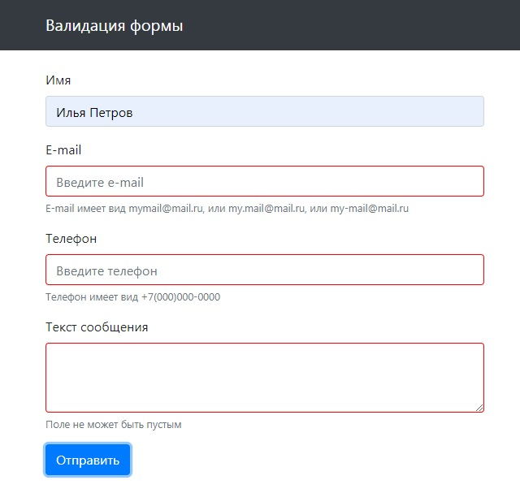

# validation-form
Форма обратной связи с валидацией
---
### Особенности
---
- вёрстка Bootstrap
- передача данных через объект FormData
- обработка события submit без перезагрузки страницы
- подсказки при неправильном вводе
- проверка корректности ввода с помощью regExp
- возможность простого расширения за счёт карты полей
- очистка полей ввода после отправки сообщения
---
### [демо ➫](https://avavax.ru/src/2003/)

